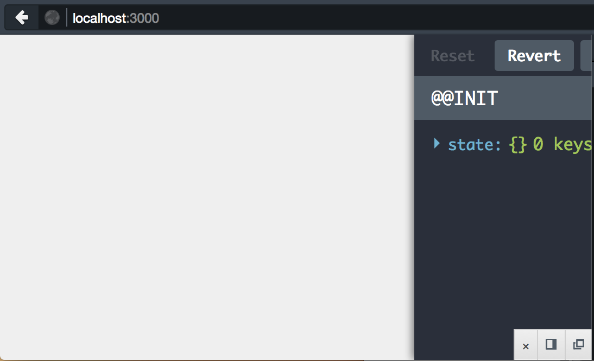
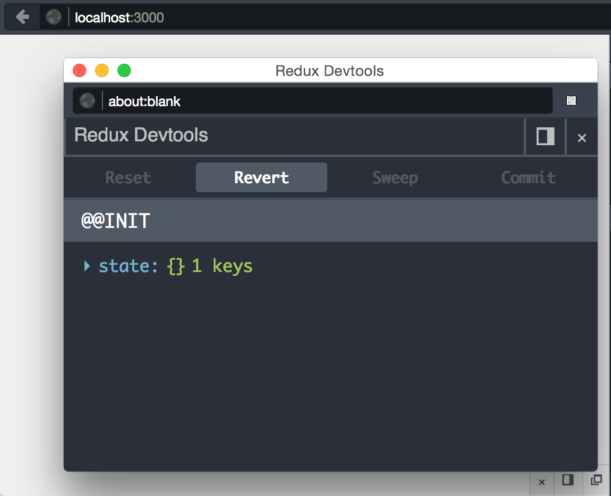

# Redux Devtools UI

An opinionated UI on top of [redux-devtools](https://github.com/gaearon/redux-devtools).
Provides a toolbar to toggle in docked mode or pop open into a new window.




### Example usage:

```jsx
import React from 'react';
import ReactDOM from 'react-dom';
import {ReduxRouter} from 'redux-router';
import Devtools from 'redux-devtools-ui';

import {Provider} from 'react-redux';
import createReduxStore from './redux';
import createHistory from 'history/lib/createBrowserHistory';

const store = createReduxStore(createHistory);

const app = (
  <Provider store={store}>
    <ReduxRouter />
  </Provider>
);

ReactDOM.render((
  process.env.NODE_ENV === 'development'
  ? <Devtools store={store}>{app}</Devtools>
  : app
), document.getElementById('app'));
```

## License

MIT Licensed. Copyright (c) 2015 Dustan Kasten

